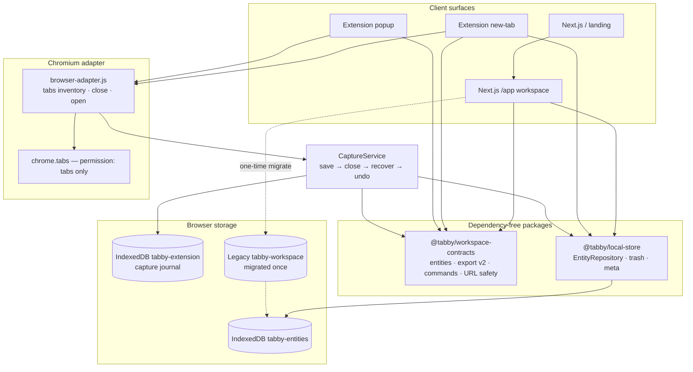

# Architecture overview (stable boundaries)

This diagram reflects what ships today in the local private alpha — not future sync, Plasmo, or collaboration surfaces.

## Ownership rules

1. **Commands before UI** — React and extension pages call `applyCommand` / message types; they do not invent persistence rules.
2. **Contracts stay dependency-free** — no React, Next, IndexedDB, or `chrome.*` inside `@tabby/workspace-contracts`.
3. **`chrome.*` stays in the adapter** — capture/restore orchestration lives in `CaptureService`.
4. **Two IndexedDB databases by design** — organization entities (`tabby-entities`) and the capture journal (`tabby-extension`) until a later cutover card.
5. **No sync surface yet** — `src/server/**` auth/DB code exists as scaffold only; local mode must not require it.

## Key paths

| Concern            | Path                                                        |
| ------------------ | ----------------------------------------------------------- |
| Web UI             | `src/app/_components/workspace-app.tsx`, `landing-page.tsx` |
| Web store adapter  | `src/lib/workspace-store.ts`                                |
| Contracts          | `apps/extension/packages/workspace-contracts/`              |
| Entity store       | `apps/extension/packages/local-store/`                      |
| Capture + recover  | `apps/extension/core.js`                                    |
| Extension surfaces | `apps/extension/newtab.*`, `popup.*`, `background.js`       |
| ADRs               | `docs/adr/`                                                 |
